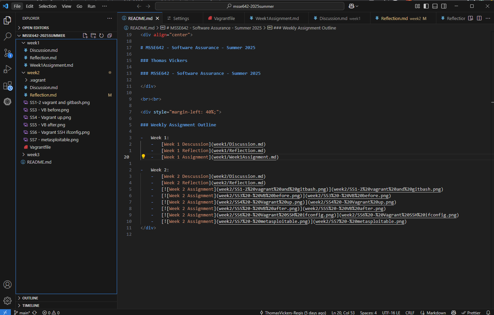
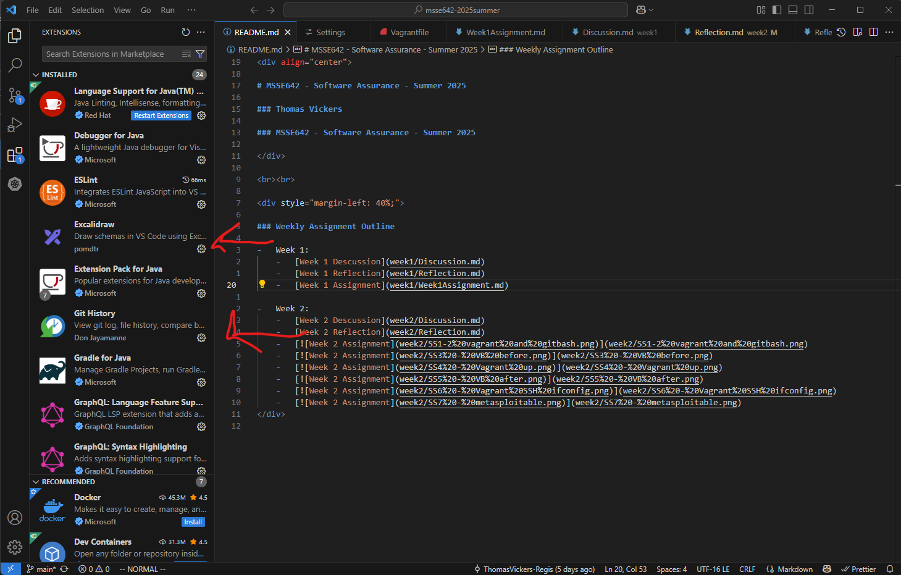
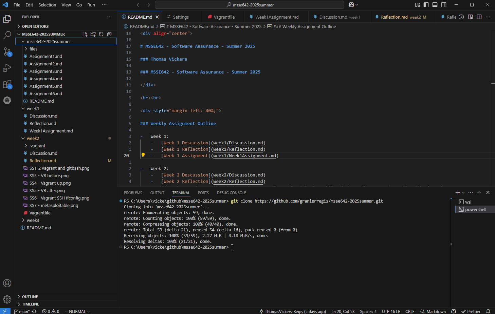

# Assignment 2 - Vickers

## MSSE640 - Software Security Engineering
**Week 3 Assignment: Visual Studio Code, Version Control, and Writing a Good README**

---

## Table of Contents
1. [Objective](#objective)
2. [Prerequisites](#prerequisites)
3. [Activity 1: Configure Visual Studio Code (VSC)](#activity-1-configure-visual-studio-code-vsc)
4. [Activity 2: Clone the Class Repo and Add to Workspace](#activity-2-clone-the-class-repo-and-add-to-workspace)
5. [Activity 3: Writing a Good README File](#activity-3-writing-a-good-readme-file)
6. [Advanced Exercises](#advanced-exercises)
7. [References](#references)

---

## Objective
This week you will:
- Work with Visual Studio Code and Version Control
- Learn to write good markdown and a good README file

---

## Prerequisites
- **Windows users only:** Git Bash installed (not necessary for Mac and Linux)
- Visual Studio Code installed
- Your local student repo

---

## Activity 1: Configure Visual Studio Code (VSC)

Open a terminal window in VSC, navigate to your repo, and issue some git commands at the CLI (see README.md for examples).

**Screenshot: Visual Studio Code running locally**



Install the following extensions in VSC:
- Excalidraw
- Git History
- Python (and any other Python extensions you might want)

**Screenshot: Visual Studio Code Extensions**



---

## Activity 2: Clone the Class Repo and Add to Workspace

Clone the class repo so that you have a local copy:
```sh
git clone https://github.com/granierregis/msse642-2025summer.git
```

Ensure that your student repo and the class repo folders are open in VSC. Save as a VSC workspace.

**Screenshot: Both repos in VSC workspace**



---

## Activity 3: Writing a Good README File

### What Makes a Good README?
A good README file is essential for any software project. It serves as the front page for your repository, helping users and contributors understand, install, use, and contribute to your project. Here are the key elements, with details and best practices for each:

#### 1. Project Title
- Clearly state the name of your project at the top of the README.
- Use a large heading (e.g., `# Project Title`).
- Optionally, include a short tagline or description right below the title.

#### 2. Project Description
- Provide a concise summary of what your project does and its purpose.
- Explain the main features and goals.
- Mention the intended audience or use cases.
- Example: "This application classifies triangles based on side lengths and demonstrates robust input validation and error handling."

#### 3. Table of Contents (Optional)
- Useful for longer README files to help users quickly find sections.
- Use markdown links to each section (e.g., `[Installation](#installation)`).

#### 4. How to Install and Run the Project
- List prerequisites (e.g., Node.js, Python, etc.).
- Provide step-by-step instructions for installation and setup.
- Include commands for cloning the repo, installing dependencies, and running the project.
- Example:
  ```sh
  git clone <repo-url>
  cd <project-folder>
  npm install
  npm run dev
  ```
- Mention platform-specific instructions if needed (Windows, macOS, Linux).

#### 5. How to Use the Project
- Explain how to interact with the application (e.g., web interface, API endpoints, CLI commands).
- Provide example inputs and outputs.
- Include screenshots or GIFs to illustrate usage.
- Example: "Enter three side lengths and click 'Classify Triangle' to see the result."

#### 6. Credits
- Acknowledge contributors, collaborators, or third-party libraries.
- Optionally, include links to their profiles or websites.
- Example: "Developed by Thomas Vickers for MSSE640."

#### 7. License
- Clearly state the license under which the project is distributed (e.g., MIT, Apache 2.0, GPL).
- Include a link to the full license text if possible.
- Example: `This project is licensed under the MIT License.`

#### 8. Badges
- Add badges for build status, license, version, or other relevant metrics.
- Use services like [shields.io](https://shields.io/) to generate badges.
- Place badges near the top of the README for visibility.

#### 9. How to Contribute
- Provide guidelines for contributing (e.g., pull request process, code style, issue reporting).
- Link to a `CONTRIBUTING.md` file if available.
- Example: "Fork the repo, create a new branch, make your changes, and submit a pull request."

#### 10. Tests
- Explain how to run tests for the project.
- List commands for running unit, integration, or end-to-end tests.
- Optionally, include coverage reports or test result badges.
- Example:
  ```sh
  npm test
  ```

#### 11. References
- List any resources, articles, or documentation that helped with the project.
- Include links to official docs, tutorials, or related projects.
- Example: "[How to Write a Good README File](https://www.freecodecamp.org/news/how-to-write-a-good-readme-file/)"

---

A well-structured README improves the usability, maintainability, and professionalism of your project. It helps others get started quickly and encourages collaboration.

---

## Advanced Exercises

### Article: [Bullshit Article](https://www.freecodecamp.org/news/how-to-write-a-good-readme-file/)

#### 1. Distinguishing Mistakes vs. "Bullshit" in Systems
A system that makes mistakes and a system that "bullshits" are fundamentally different in their relationship to truth and reliability. Mistakes in software systems are typically the result of bugs, limitations, or incomplete data. These errors are often traceable, reproducible, and, most importantly, unintentional. For example, a calculator that returns an incorrect sum due to a coding error is making a mistake. The error can be diagnosed, fixed, and, once corrected, the system will reliably produce the right result in the future.

In contrast, a system that "bullshits"—to use philosopher Harry Frankfurt’s definition—generates plausible-sounding but unreliable output without regard for truth or accuracy. Large language models (LLMs) like ChatGPT can sometimes fall into this category. When prompted for information, they may fabricate references, invent facts, or provide answers that sound convincing but are not grounded in any underlying knowledge or verification process. This is not a bug in the traditional sense, but a consequence of the model’s design: it is trained to produce text that is statistically likely, not necessarily true.

The distinction is important because it affects how users should interact with and trust these systems. A system that makes mistakes can be improved through debugging and better data. A system that bullshits, however, requires a different approach: users must be skeptical, verify outputs, and understand the limitations of the technology. In real-world scenarios, this distinction matters greatly. For example, in academic or journalistic contexts, using a system that bullshits can lead to the spread of misinformation, even if the system is not intentionally deceptive. The responsibility then falls on both the designers and users to ensure that outputs are verified and that the system’s limitations are clearly communicated.

#### 2. Responsibilities When Designing/Integrating LLMs
As software engineers, we have significant ethical and practical responsibilities when designing or integrating large language models (LLMs) into products and services. First and foremost, transparency is key. Users should be made aware when they are interacting with an AI system, and the limitations of that system should be clearly communicated. This includes acknowledging that LLMs can generate plausible but unverified or even incorrect information.

Engineers must also implement safeguards to prevent the spread of misinformation. This can include integrating fact-checking modules, requiring citations for factual claims, and providing warnings when the AI is uncertain or likely to hallucinate. In high-stakes domains—such as healthcare, law, or finance—AI outputs should always be reviewed by qualified humans before being acted upon.

Another responsibility is to design for accountability. If an AI system causes harm, there should be clear processes for tracing decisions and correcting errors. This may involve logging interactions, providing explanations for outputs, and allowing users to report problematic content. Engineers should also consider the broader social impacts of their systems, such as the potential for bias, discrimination, or manipulation.

Finally, ongoing monitoring and improvement are essential. LLMs should be regularly evaluated for accuracy, fairness, and safety, and updated as new risks or issues are discovered. By taking these responsibilities seriously, engineers can help ensure that LLMs are used ethically and effectively, minimizing harm and maximizing benefit to society.

#### 3. Mitigating Misinformation with the Same Tools
The same AI tools that can generate misinformation can also be engineered to detect or mitigate it. This dual-use nature of LLMs presents both challenges and opportunities. On the one hand, LLMs can produce convincing but false narratives, making them a potential vector for disinformation campaigns. On the other hand, their ability to process and analyze vast amounts of text can be harnessed to identify, flag, and correct misinformation.

One approach is to use LLMs as fact-checkers. By training models to cross-reference claims with trusted sources, AI can help verify the accuracy of information before it is published or shared. Adversarial training—where models are exposed to both true and false information—can improve their ability to distinguish between reliable and unreliable content. Additionally, integrating LLMs with external databases and APIs can provide real-time access to up-to-date, authoritative information.

Design patterns such as requiring citations, providing confidence scores, and flagging uncertain outputs can further reduce the risk of misinformation. User interfaces can be designed to encourage critical thinking, such as by highlighting potentially dubious claims or prompting users to seek additional verification. Ultimately, while LLMs are not a panacea, thoughtful engineering and responsible deployment can turn them into powerful tools for both producing and combating misinformation. The key is to recognize their limitations, design for transparency and accountability, and continuously monitor their real-world impact.

---

## References
- [How to Write a Good README File](https://www.freecodecamp.org/news/how-to-write-a-good-readme-file/)
- [VS Code Extensions Marketplace](https://marketplace.visualstudio.com/)
- [GitHub Docs: Cloning a repository](https://docs.github.com/en/repositories/creating-and-managing-repositories/cloning-a-repository)

